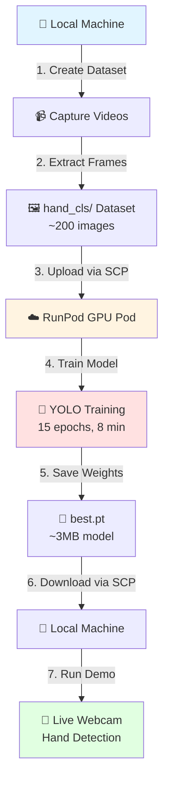

# Hand Classification Workshop: Fine-tuning YOLOv8

Train your own hand detection AI in 15 minutes using transfer learning and cloud GPUs.

**Learn:** Transfer learning • Dataset preparation • Cloud GPU training • Real-time inference

---

## 🚀 Quick Start

**Never done this before? Start here:**

1. **Choose your setup guide** for your platform:
   - 🍎 [Mac Setup](SETUP_Mac.md) - macOS with Apple Silicon or Intel
   - 🪟 [Windows Setup](SETUP_Windows.md) - Windows 10/11 with WSL or native
   - 🐧 [Linux Setup](SETUP_Linux.md) - Ubuntu/Debian systems

2. **Follow the 15-minute workflow:**
   ```bash
   # 1. Create your dataset (3 minutes)
   python3 capture_and_prepare.py

   # 2. Upload to GPU & train (8 minutes)
   # See your setup guide for commands

   # 3. Test your model (2 minutes)
   python3 live_demo.py --weights best_trained.pt
   ```

3. **📖 Detailed walkthrough:** [WORKSHOP.md](WORKSHOP.md) has the complete step-by-step guide

4. **⚡ Quick reference:** [RUNPOD_CHEATSHEET.md](RUNPOD_CHEATSHEET.md) for copy-paste commands

5. **🔧 Technical deep-dive:** [docs/TECHNICAL_GUIDE.md](docs/TECHNICAL_GUIDE.md) explains how it works

---

## 📊 Workflow Diagram



**What happens at each step:**

| Step | Location | Action | Time | Output |
|------|----------|--------|------|--------|
| 1-2 | Local | Record videos of hands/no-hands, extract frames | 3 min | `hand_cls/` dataset (~200 images) |
| 3 | Local → Cloud | Upload dataset to RunPod GPU via SCP | 1 min | Dataset on cloud |
| 4-5 | Cloud | Train YOLOv8 classifier (15 epochs) | 8 min | `best.pt` trained model |
| 6 | Cloud → Local | Download trained model via SCP | 1 min | `best_trained.pt` locally |
| 7 | Local | Run live demo with webcam | ∞ | Real-time hand detection |

**Total time:** ~15 minutes (3 min local + 8 min training + 2 min transfers + 2 min testing)

**Cost:** ~$0.03 for RTX A5000 @ $0.25/hr × 8 minutes (minimum $10 RunPod credit required)

---

## 📚 Documentation Guide

**Choose your path:**

- **First-time user?** → Start with your platform's setup guide above
- **Want the full story?** → Read [WORKSHOP.md](WORKSHOP.md)
- **Need quick commands?** → Use [RUNPOD_CHEATSHEET.md](RUNPOD_CHEATSHEET.md)
- **Understand the ML?** → Read [docs/TECHNICAL_GUIDE.md](docs/TECHNICAL_GUIDE.md)
- **Troubleshooting?** → Check the Troubleshooting section in your setup guide

## What You'll Learn

- ✅ **Transfer Learning** - Fine-tune a pretrained YOLOv8 classifier (1000 classes → 2 classes)
- ✅ **Dataset Preparation** - Capture videos, extract frames, organize train/val splits
- ✅ **Cloud GPU Training** - Use RunPod to train 100x faster than CPU
- ✅ **Real-time Inference** - Run live webcam demo with your trained model
- ✅ **End-to-End ML Pipeline** - Data collection → Training → Deployment

---

## What You'll Build

```
Input: Webcam feed
         ↓
   Your trained model
         ↓
Output: "Hand detected!" or "No hand"
```

**Artifacts you'll create:**
- `hand_cls/` — Custom dataset (~200 images, 80/20 train/val split)
- `best_trained.pt` — Trained classifier (~3MB, 100% validation accuracy)
- `live_demo.py` — Working real-time hand detection app

---

## Training Command

```bash
yolo classify train model=yolov8n-cls.pt data=/workspace/hand_cls epochs=15 batch=32 device=0
```

**What this does:**
- `model=yolov8n-cls.pt` — Start with pretrained YOLOv8 nano (fastest, trained on ImageNet)
- `data=/workspace/hand_cls` — Your custom dataset (auto-finds train/val folders)
- `epochs=15` — 15 complete passes through training data (~8 minutes on GPU)
- `batch=32` — Process 32 images at once (fits in 24GB GPU memory)
- `device=0` — Use first GPU (CUDA device 0)

**Output:** `runs/classify/train/weights/best.pt` (best model based on validation accuracy)

---

## Live Demo

```bash
python3 live_demo.py --weights best_trained.pt
```

**Features:**
- Real-time webcam inference
- Confidence scores displayed
- Green/red visual indicators
- Press `q` to quit

---

## Technical Details

**Model Architecture:**
- Base: YOLOv8n classifier (1,440,850 parameters)
- Transfer learning: 156/158 layers transferred from ImageNet
- Fine-tuned: Only final classification head (2 classes: hand/not_hand)

**Dataset:**
- Input: 20-second videos captured at 30fps
- Processing: Extract frames at 5fps (~100 frames per video)
- Split: 80% training, 20% validation
- Total: ~200 images (balanced classes)

**Training:**
- Optimizer: AdamW (auto-selected by YOLO)
- Learning rate: 0.000714 (auto-calculated)
- Hardware: RTX A5000 (24GB VRAM, ~100x faster than CPU)
- Time: ~8 minutes for 15 epochs

**Performance:**
- Validation accuracy: 100% (simple binary task with good data)
- Inference speed: ~50ms per frame on GPU, ~200ms on CPU
- Model size: ~3MB (compressed PyTorch weights)

---

## Repository Structure

```
finetune-workshop/
├── capture_and_prepare.py      # Main workflow: capture videos + extract frames
├── capture_dataset_videos.py   # Record webcam videos (20s each)
├── extract_frames_to_dataset.py # Extract frames at 5fps, split 80/20
├── live_demo.py                # Real-time webcam demo
├── debug_demo.py               # Debug version with all class confidences
├── hand_cls/                   # Your dataset (created by scripts)
│   ├── train/hand/            # Training images with hands
│   ├── train/not_hand/        # Training images without hands
│   ├── val/hand/              # Validation images with hands
│   └── val/not_hand/          # Validation images without hands
├── docs/TECHNICAL_GUIDE.md    # Deep-dive: how YOLO training works
├── WORKSHOP.md                # Step-by-step walkthrough
├── SETUP_Mac.md               # macOS-specific setup
├── SETUP_Windows.md           # Windows-specific setup
├── SETUP_Linux.md             # Linux-specific setup
└── RUNPOD_CHEATSHEET.md      # Quick command reference
```

---

## Credits

- **Base model:** [Ultralytics YOLOv8](https://github.com/ultralytics/ultralytics)
- **GPU provider:** [RunPod](https://runpod.io)
- **Framework:** [PyTorch](https://pytorch.org)

---

Enjoy the workshop! 🎃👻
